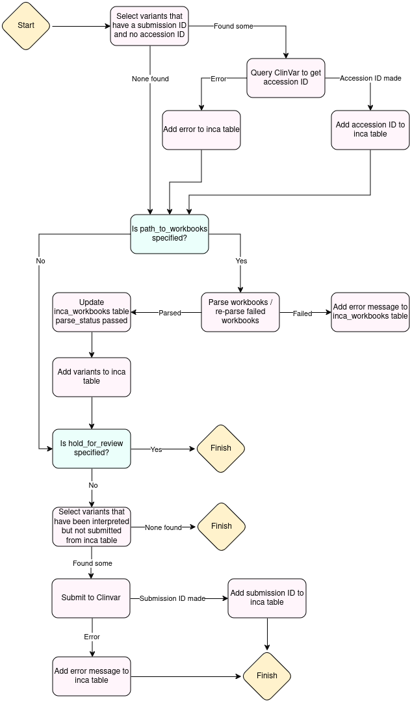

# clinvar submissions process

## What does this script do?
This script searches a given folder for Excel variant workbooks that have not previously been parsed successfully, extracts variants from those workbooks and adds variants to the INCA table. It then checks all the variants in the INCA table for an Interpreted status of 'yes' and submits those that have been interpreted to ClinVar.

## Process map


## Inputs
**Required:**
* `--clinvar_api_key`: JSON file containing ClinVar API keys for CUH and NUH. Should be in the format:

    ```JSON
    {
        "cuh": "1234567890",
        "nuh": "0987654321"
    }
    ```
* `--db_credentials`: JSON file containing AWS database credentials. Should be in the format:

    ```JSON
    {
        "user": "username",
        "pwd": "password",
        "endpoint": "asdfghjkl.rds.amazonaws.com"
    }
    ```
* `--config`: config file, should be the config.json from https://github.com/eastgenomics/clinvar_submissions_config.

**Optional:**
* `--clinvar_testing`: (boolean) Default is False, if specified as True will use the test clinvar endpoint
* `--print_submission_json`: (boolean) Default is False, if specified as True will print each clinvar submission to the terminal. This is useful for testing.
* `--hold_for_review`: (boolean) Default is False, if specified as True, will add the variants to the database but not submit to ClinVar. Can be used to allow manual review before submission.
* `--path_to_workbooks`: Local path to Excel workbooks that need submitting. If not specified, parsing will be skipped and the script will only run the accession ID retrieval process.