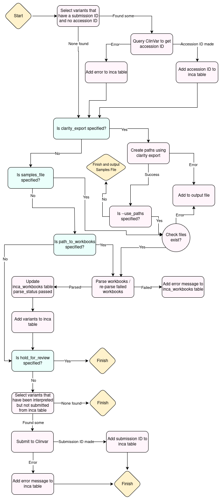

# clinvar submissions process

## What does this script do?
This script searches a given folder for Excel variant workbooks that have not previously been parsed successfully, extracts variants from those workbooks and adds variants to the INCA table. It then checks all the variants in the INCA table for an Interpreted status of 'yes' and submits those that have been interpreted to ClinVar.

## Process map


## Inputs
**Required:**
* `--clinvar_api_key`: JSON file containing ClinVar API keys for CUH and NUH. Should be in the format:

    ```JSON
    {
        "cuh": "1234567890",
        "nuh": "0987654321",
        "dnanexus": "ASDFGHJKLQWERTYUIOP"
    }
    ```
* `--db_credentials`: JSON file containing AWS database credentials. Should be in the format:

    ```JSON
    {
        "user": "username",
        "pwd": "password",
        "endpoint": "asdfghjkl.rds.amazonaws.com"
    }
    ```
* `--config`: config file, should be the config.json from https://github.com/eastgenomics/clinvar_submissions_config.
* `--organisation`: Organisation to submit for, either "CUH" or "NUH". This determines which ClinVar API key and submission URL to use.
* `--output_dir`: (path to output directory) the script will output any inconsistent/parsed Clarity files to this directory.

### One option which specifies the run-mode i.e. from clarity extract, workbooks path or samples_file:
These are mutually exclusive, one must be specified.
* `--path_to_workbooks`: Local path to Excel workbooks that need submitting.
* `--samples_file`: Local path to a CSV file containing sample information. If specified, the script will use this file instead of searching for workbooks. The CSV should have columns for `file_name`, `sample_id`, `workbook_path`. This can be generated by the script from a clarity extract.
* `--clarity_extract`: (path to clarity extract CSV file): If specified, the script will parse the clarity extract file to get sample and workbook information and either use the paths directly (if --use_paths is specified) or output a samples file CSV for review.
  This will contain:
  * Beaker Procedure Name
  * Received Specimen Date Time
  * Specimen Identifier
  * Test Directory Test Code
  * Test Validation Status
  * Last Final Verify Date

**Optional:**
* `--use_paths`: (boolean) Default is False, if specified, will use the paths from the clarity extract directly. If False, will output a CSV for review.
* `--no_retry`: (boolean) Default is False, if specified will not retry failed submissions.
* `--clinvar_testing`: (boolean) Default is False, if specified will use the test clinvar endpoint
* `--print_submission_json`: (boolean) Default is False, if specified will print each clinvar submission to the terminal. This is useful for testing.
* `--hold_for_review`: (boolean) Default is False, if specified, will add the variants to the database but not submit to ClinVar. Can be used to allow manual review before submission.
* `--dry_run`: (boolean) Default is False, if specified, will not make any changes to the database or submit to ClinVar. Useful for testing.

## Example usage
```bash
python pandora.py \
    --clinvar_api_key clinvar_api_keys.json \
    --db_credentials db_credentials.json \
    --config config.json \
    --clinvar_testing \
    --print_submission_json \
    --hold_for_review \
    --path_to_workbooks /path/to/workbooks/ \
    --organisation "CUH" \
    --output_dir "/output"
or
python pandora.py \
    --dry_run \
    --clinvar_api_key clinvar_api_keys_test.json \
    --db_credentials test_db_config.json \
    --config test_db_config.json \
    --clinvar_testing \
    --print_submission_json \
    --hold_for_review \
    --clarity_extract data/test_extract_file_250710.csv \
    --organisation "CUH" \
    --output_dir "/output"
```
